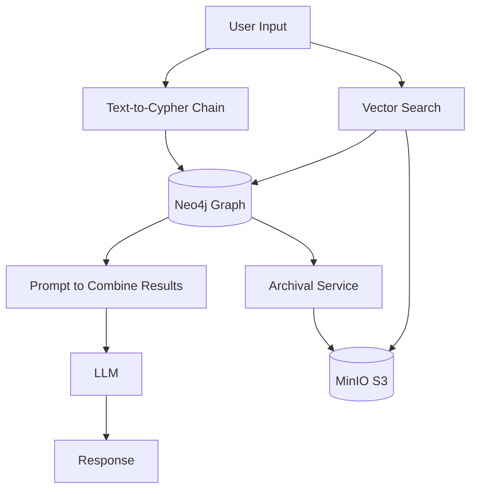
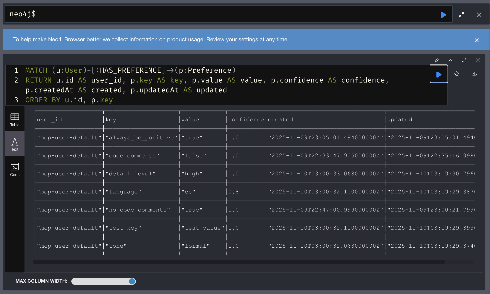
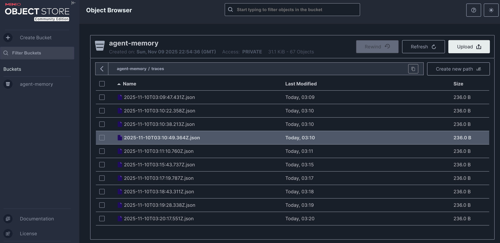

<div align="center">
  <h1>Cognia - Agent Memory System</h1>
  
</div>

> Accelerated development with Cursor

Graph RAG-based agent memory system using Neo4j, vector embeddings, and LLMs for intelligent contextual recall.

## Architecture



## Data Model

The system uses a Neo4j graph database to store conversations, extracted entities, facts, and tool calls. The graph structure enables semantic search via vector embeddings and relationship traversal for context-aware retrieval.

**📖 See [docs/schema.md](docs/schema.md) for the complete schema diagram and documentation.**

## Documentation

### Sequence Diagrams

Detailed sequence diagrams showing how different operations work:

- **[Store Message](docs/sequences-store-message.md)** - How messages are stored with entity and fact extraction
- **[Recall Memories](docs/sequences-recall-memories.md)** - Semantic search and retrieval flow
- **[Hybrid Retrieval](docs/sequences-hybrid-retrieval.md)** - Advanced retrieval with pattern expansion and reranking
- **[Tool Tracking](docs/sequences-tool-tracking.md)** - How tool calls are tracked for pattern learning
- **[Archival](docs/sequences-archival.md)** - Long-term storage to MinIO
- **[Preferences](docs/sequences-preferences.md)** - User preference management and personalized retrieval
- **[MCP Server](docs/sequences-mcp-server.md)** - MCP tool call flow through the server

### Reference Documentation

- **[Configuration](docs/configuration.md)** - Complete configuration reference with all environment variables
- **[Constants](docs/constants.md)** - Retrieval limits, weights, and thresholds reference
- **[Schema](docs/schema.md)** - Database schema and data model
- **[Performance](docs/performance.md)** - MCP server performance benchmarks
- **[Long-Term Memory](docs/long-term-memory.md)** - How archival works and integrated memory retrieval

### Future Features

- **[Roadmap](ROADMAP.md)** - Planned performance optimizations and incomplete features

### Schema Management

The schema is automatically initialized when you start the services with `docker compose up`. The bootstrap container will create all constraints, indexes, and vector indexes.

To verify the schema was applied correctly:

```bash
yarn verify-schema
```

This will check that all required constraints and indexes are present in your Neo4j database.

Alternatively, you can verify manually in the Neo4j Browser (http://localhost:7474) using the queries in `scripts/verify-schema.cypher`.

## Quick Start

### Prerequisites

- **Node.js** >= 22.0.0 (use [nvm](https://github.com/nvm-sh/nvm) with `.nvmrc`)
- **Docker** and **Docker Compose**
- **Ollama** running locally (for LLM and embeddings)
- **Embeddings model** pulled in Ollama (default: `ai/mxbai-embed-large`)

### Setup

1. **Start services:**

```bash
docker compose up -d
```

This starts:

- Neo4j (port 7474 for browser, 7687 for Bolt)
- MinIO (port 9000 for API, 9001 for console)
- Schema bootstrap container (runs automatically)

2. **Verify setup:**

```bash
yarn verify-schema
```

3. **Access services:**

- Neo4j Browser: http://localhost:7474 (neo4j/password)
- MinIO Console: http://localhost:9001 (minioadmin/minioadmin)




4. **Create MinIO bucket:**

The archival service requires a bucket named `agent-memory`. Create it manually via the MinIO Console:

1. Open http://localhost:9001
2. Login with `minioadmin` / `minioadmin`
3. Click "Create Bucket"
4. Name it `agent-memory`
5. Click "Create Bucket"

Alternatively, use the MinIO CLI:

```bash
docker exec -it cognia-minio mc alias set local http://localhost:9000 minioadmin minioadmin
docker exec -it cognia-minio mc mb local/agent-memory
```

**Note:** The bucket will be created automatically when the archival service is first used, but creating it manually ensures it's ready from the start.

5. **Run MCP server (optional):**

The MCP server exposes Cognia's memory system as tools for AI assistants via the [Model Context Protocol](https://modelcontextprotocol.io/).

**Build and run:**

```bash
make mcp-server
# or
yarn mcp-server
```

**Configure in Cursor:**
The MCP server is pre-configured in `.cursor/mcp.json`. **Important:** You must build the project first (`yarn build`) before Cursor can use the MCP server. After building, restart Cursor or reload the window to connect to the MCP server.

**Configure in Claude Desktop:**

1. Build the project: `yarn build`
2. Open or create the Claude Desktop config file:
   - **macOS**: `~/Library/Application Support/Claude/claude_desktop_config.json`
   - **Windows**: `%APPDATA%\Claude\claude_desktop_config.json`
   - **Linux**: `~/.config/Claude/claude_desktop_config.json`
3. Add the Cognia MCP server configuration:

```json
{
  "mcpServers": {
    "cognia": {
      "command": "node",
      "args": ["/absolute/path/to/cognia/dist/src/server/mcp-server.js"],
      "env": {
        "NEO4J_URI": "bolt://localhost:7687",
        "NEO4J_USER": "neo4j",
        "NEO4J_PASSWORD": "password",
        "OLLAMA_HOST": "localhost",
        "OLLAMA_PORT": "12434",
        "EMBED_MODEL": "ai/mxbai-embed-large",
        "LLM_MODEL": "llama3.2",
        "MINIO_ENDPOINT": "localhost:9000",
        "MINIO_ROOT_USER": "minioadmin",
        "MINIO_ROOT_PASSWORD": "minioadmin",
        "MINIO_BUCKET": "agent-memory",
        "MINIO_SECURE": "false"
      }
    }
  }
}
```

4. Replace `/absolute/path/to/cognia` with the actual absolute path to your Cognia project directory (e.g., `/Users/username/dev/cognia` on macOS)
5. Update all environment variables in the `env` section to match your `.env` file values
6. Restart Claude Desktop to connect to the MCP server

**Note:** If you already have other MCP servers configured, merge the `cognia` entry into your existing `mcpServers` object rather than replacing it.

**Available MCP Tools:**

- `store_memory` - Store messages with entity and fact extraction
- `recall_memories` - Semantic search (includes archived data by default, disable with `include_archived=false`)
- `track_tool_usage` - Track tool calls for pattern learning
- `set_preference` / `get_preferences` - User preference management
- `get_session_info` - Get current session and user IDs
- `list_archived_sessions` - List archived sessions with metadata (limit 1-1000)
- `replay_session` - Retrieve/replay archived session, optionally restore to Neo4j

## Development

```bash
make help          # Show all available commands
```

### Debug Helpers

- **Verify schema**: `yarn verify-schema` or `scripts/verify-schema.cypher`
- **Explore database**: `scripts/debug-queries.cypher` in Neo4j Browser

## Features

### Core Memory Operations

- **Session-based message storage** with vector embeddings
- **Semantic similarity search** using Neo4j vector indexes
- **Entity extraction** from messages using LLM
- **Fact extraction** with entity linking
- **User preferences** for personalized retrieval

### Advanced Retrieval

- **Hybrid search** combining vector similarity and graph patterns
- **Pattern expansion** with 1-2 hop graph traversal
- **Re-ranking** with weighted scoring:
  - Vector similarity (70%)
  - Recency decay (20%)
  - Importance (10%)
  - User preference matching
- **Multi-hop entity relationships**

### Tool Intelligence

- **Tool call tracking** with success/failure status
- **Pattern learning** from past tool executions
- **Failure recovery patterns** - learn what fixes worked
- **Latency monitoring** for performance optimization

### Long-term Storage

- **Automatic archival** to MinIO (S3-compatible) - Old sessions (>90 days) are archived to MinIO
- **Configurable retention** (default: 90 days) - Sessions older than this are archived
- **Integrated memory retrieval** - Archived sessions are searched alongside active data when recalling memories
- **Semantic search** - Archived messages are retrieved using vector similarity search
- **Tool trace logging** for audits - Tool traces can be archived separately

**Note:** `recall_memories` searches both active Neo4j data and archived MinIO sessions by default. Set `include_archived=false` to search only recent data for faster queries.

### RAG Integration

- **Context-aware responses** using retrieved memories
- **Document synthesis** from facts and messages
- **LLM integration** via Ollama

## Configuration

**📖 See [docs/configuration.md](docs/configuration.md) for the complete configuration reference.**

Quick reference - environment variables in `.env`:

```bash
NEO4J_URI=bolt://localhost:7687
NEO4J_USER=neo4j
NEO4J_PASSWORD=password

OLLAMA_HOST=localhost
OLLAMA_PORT=12434
EMBED_MODEL=ai/mxbai-embed-large
LLM_MODEL=llama3.2
LLM_TIMEOUT_MS=60000
EMBEDDING_TIMEOUT_MS=30000

MINIO_ENDPOINT=localhost:9000
MINIO_ROOT_USER=minioadmin
MINIO_ROOT_PASSWORD=minioadmin
MINIO_BUCKET=agent-memory
MINIO_SECURE=false

MEMORY_DECAY_DAYS=30
ARCHIVE_AGE_DAYS=90

LOG_LEVEL=info
```
