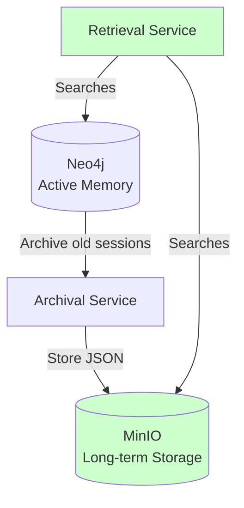

# Long-Term Memory (Archival)

## Overview

Cognia archives old sessions to MinIO (S3-compatible storage) for long-term retention. Archived sessions are searchable alongside active data.

## Current State

### What Works

✅ **Archiving**: Sessions older than 90 days (configurable via `ARCHIVE_AGE_DAYS`) are automatically archived to MinIO

- Sessions include messages (with embeddings), entities, and tool calls
- Data is stored as JSON files in `sessions/{sessionId}/{timestamp}.json`
- Tool traces can be archived separately to `traces/{timestamp}.json`

✅ **Retrieval Methods**: The `ArchivalService` provides methods to retrieve archived data:

- `retrieveSession(objectName)` - Retrieve a specific archived session
- `listArchivedSessions(prefix)` - List all archived sessions
- `listArchivedSessionsWithMetadata(prefix)` - List archived sessions with metadata (session IDs, timestamps, message counts)
- `archiveToolTraces(traces)` - Archive tool execution traces

✅ **MCP Tools for Archived Sessions**:

- `list_archived_sessions` - List archived sessions from MinIO with metadata (session IDs, timestamps, message counts)
- `replay_session` - Retrieve and replay an archived session, optionally restore it back to Neo4j for search

✅ **Integration with Memory Retrieval**: Archived sessions are searched when recalling memories

- The `recall_memories` tool searches both active data in Neo4j and archived sessions in MinIO
- Archived messages use pre-stored embeddings for fast similarity search
- Results from both sources are merged and reranked together
- **Enabled by default** (`include_archived=true`) with ~1s latency due to MinIO I/O overhead
- Set `include_archived=false` to search only recent data for ~90ms response times

## Architecture

## How Archival Works

See [sequences-archival.md](sequences-archival.md) for the detailed sequence diagram.

1. **Trigger**: Archival can be triggered manually or scheduled
2. **Query**: Find sessions with last activity older than `ARCHIVE_AGE_DAYS`
3. **Extract**: Collect all messages, entities, and tools for each session
4. **Store**: Write session data as JSON to MinIO
5. **Optional**: Delete archived sessions from Neo4j (not currently implemented)

## How Archived Memory Retrieval Works

See the "Integration with Memory Retrieval" section above for configuration details (default behavior, latency, etc.).

When `recall_memories` is called:

1. **Query Processing**: The query is converted to an embedding vector
2. **Active Memory Search**: Searches active messages in Neo4j using vector similarity
3. **Archived Memory Search** (if enabled):
   - Lists archived sessions from MinIO (up to 10 sessions by default)
   - Retrieves each session and uses pre-stored message embeddings
   - Falls back to on-the-fly generation for old archives without embeddings
   - Calculates cosine similarity between query and message embeddings
   - Scores messages using the same reranking weights (70% vector, 20% recency, 10% importance)
4. **Merging**: Combines results from both sources
5. **Reranking**: Applies final reranking with user preferences
6. **Return**: Returns top K results from the merged set
