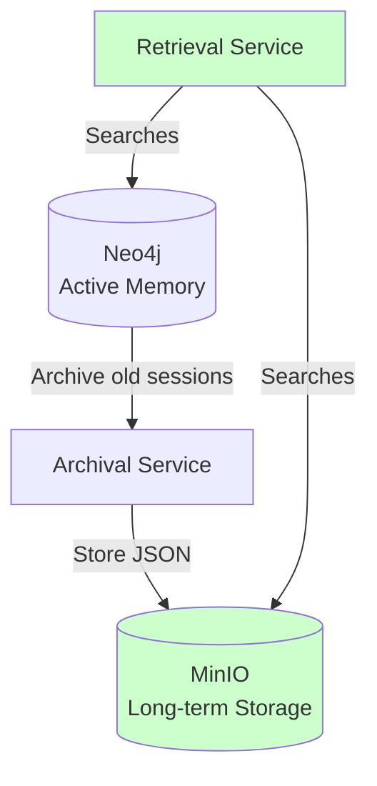

# Long-Term Memory (Archival)

## Overview

Cognia archives old sessions to MinIO (S3-compatible storage) for long-term retention. **Archived data can be searched via the `include_archived` parameter** - when enabled, the system searches both active data in Neo4j and archived sessions in MinIO.

## Current State

### What Works

✅ **Archiving**: Sessions older than 90 days (configurable via `ARCHIVE_AGE_DAYS`) are automatically archived to MinIO

- Sessions include messages (with embeddings), entities, and tool calls
- Data is stored as JSON files in `sessions/{sessionId}/{timestamp}.json`
- Tool traces can be archived separately to `traces/{timestamp}.json`

✅ **Retrieval Methods**: The `ArchivalService` provides methods to retrieve archived data:

- `retrieveSession(objectName)` - Retrieve a specific archived session
- `listArchivedSessions(prefix)` - List all archived sessions
- `listArchivedSessionsWithMetadata(prefix)` - List archived sessions with metadata (session IDs, timestamps, message counts)
- `archiveToolTraces(traces)` - Archive tool execution traces

✅ **MCP Tools for Archived Sessions**:

- `list_archived_sessions` - List archived sessions from MinIO with metadata (session IDs, timestamps, message counts)
- `replay_session` - Retrieve and replay an archived session, optionally restore it back to Neo4j for search

✅ **Integration with Memory Retrieval**: Archived sessions are searched when recalling memories

- The `recall_memories` tool searches both active data in Neo4j and archived sessions in MinIO
- Archived messages use pre-stored embeddings for fast similarity search
- Results from both sources are merged and reranked together
- **Enabled by default** (`include_archived=true`), can be disabled with `include_archived=false` for faster queries on recent data only

## Architecture



## How Archival Works

See [sequences-archival.md](sequences-archival.md) for the detailed sequence diagram.

1. **Trigger**: Archival can be triggered manually or scheduled
2. **Query**: Find sessions with last activity older than `ARCHIVE_AGE_DAYS`
3. **Extract**: Collect all messages, entities, and tools for each session
4. **Store**: Write session data as JSON to MinIO
5. **Optional**: Delete archived sessions from Neo4j (not currently implemented)

## How Archived Memory Retrieval Works

When `recall_memories` is called (with `include_archived=true` by default):

1. **Query Processing**: The query is converted to an embedding vector
2. **Active Memory Search**: Searches active messages in Neo4j using vector similarity
3. **Archived Memory Search**:
   - Lists archived sessions from MinIO (up to 10 sessions by default)
   - Retrieves each session and uses pre-stored message embeddings
   - Falls back to on-the-fly generation for old archives without embeddings
   - Calculates cosine similarity between query and message embeddings
   - Scores messages using the same reranking weights (70% vector, 20% recency, 10% importance)
4. **Merging**: Combines results from both sources
5. **Reranking**: Applies final reranking with user preferences
6. **Return**: Returns top K results from the merged set

## Future Enhancements

Potential improvements:

1. **Selective Recall**: Allow users to specify time ranges that include archived data
2. **Caching**: Cache frequently accessed archived sessions in memory

## Configuration

```bash
ARCHIVE_AGE_DAYS=90  # Sessions older than this are archived
MINIO_ENDPOINT=localhost:9000
MINIO_BUCKET=agent-memory
```

## Usage Example

### Archiving Sessions

To manually archive sessions older than a certain age:

```typescript
import { getArchivalService, archiveOldSessions } from "./archival";
import { getConnection } from "./db";

const conn = getConnection();
const session = conn.session();
const archivalService = getArchivalService();

// Archive sessions older than 90 days
const count = await archiveOldSessions(session, archivalService, 90);
console.log(`Archived ${count} sessions`);
```

### Retrieving Archived Sessions (Debugging/Audit)

To retrieve a specific archived session for debugging or audit purposes:

```typescript
const archivalService = getArchivalService();
const sessionData = await archivalService.retrieveSession(
  "sessions/session-123/2024-01-01T00:00:00Z.json"
);
console.log(sessionData.messages);
```

### Listing Archived Sessions

To list all archived sessions with metadata:

```typescript
const archivalService = getArchivalService();
const sessions = await archivalService.listArchivedSessionsWithMetadata();
console.log(sessions); // Array of {objectName, sessionId, timestamp, archivedAt, messageCount}
```

### Restoring Archived Sessions to Neo4j

To restore an archived session back to Neo4j for search:

```typescript
import { restoreSessionToNeo4j } from "./archival";

const sessionData = await archivalService.retrieveSession(
  "sessions/session-123/2024-01-01T00:00:00Z.json"
);
const stats = await restoreSessionToNeo4j(neo4jSession, sessionData);
console.log(
  `Restored ${stats.messageCount} messages, ${stats.entityCount} entities`
);
```

**Important Notes**:

- Restoring sessions uses pre-stored embeddings (falls back to generation if missing) and recreates entities/facts, which may take time for large sessions
- **Tool calls are NOT restored**: The current archival format doesn't preserve tool-to-message relationships, so tool calls cannot be accurately restored. A warning is logged when tools are present in archived data
- All messages are restored in a single batched transaction for performance
- Embeddings are processed in parallel before the transaction to optimize performance

### Using Archived Memory in Retrieval

Archived memory is enabled by default via the `include_archived` parameter in the `recall_memories` MCP tool. Set `include_archived=false` to disable and search only recent data for faster queries.

```typescript
// Via MCP tool
// Archived memory is enabled by default
// Pass include_archived=false to search only recent data for faster queries

// Programmatically
import { retrieveWithExpansionAndRerank } from "./retrieval/advanced_retrieval";
import { getEmbeddingsClient } from "./clients/embeddings";

const embeddingsClient = getEmbeddingsClient();
const queryEmbedding = await embeddingsClient.generateEmbedding("your query");

const results = await session.executeRead((tx) =>
  retrieveWithExpansionAndRerank(
    tx,
    queryEmbedding,
    userId,
    topK,
    true, // expand
    true // includeArchived - set to false to exclude archived data
  )
);
```
