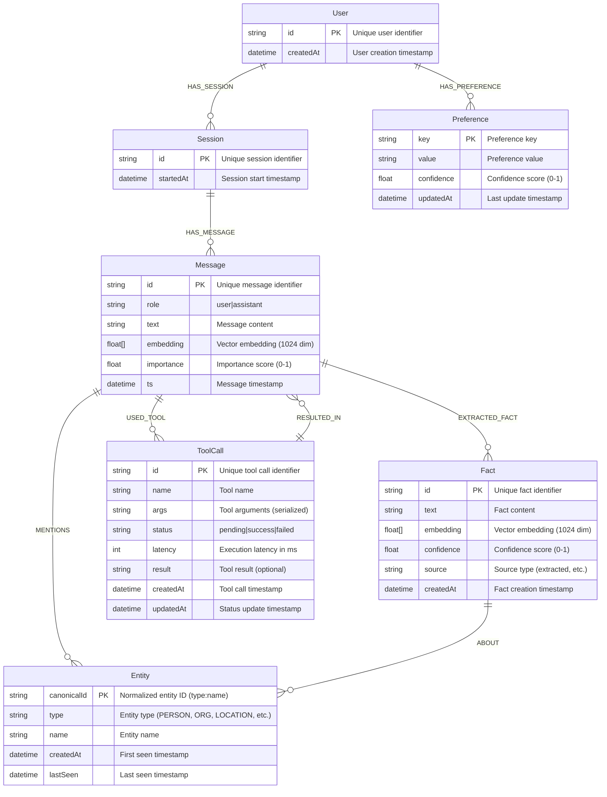

# Cognia Graph Schema

This document describes the Neo4j graph database schema used by Cognia for agent memory storage and retrieval.

## Schema Diagram



## Node Types

### User
Represents a user of the system. Users can have multiple sessions and preferences.

**Properties:**
- `id` (string, unique): User identifier
- `createdAt` (datetime): When the user was first created

**Constraints:**
- `id` must be unique

### Session
Represents a conversation session. Sessions contain multiple messages.

**Properties:**
- `id` (string, unique): Session identifier
- `startedAt` (datetime): When the session started

**Constraints:**
- `id` must be unique

### Message
Represents a message in a conversation. Messages can mention entities, extract facts, and use tools.

**Properties:**
- `id` (string, unique): Message identifier
- `role` (string): "user" or "assistant"
- `text` (string): Message content
- `embedding` (float[]): Vector embedding for semantic search (1024 dimensions)
- `importance` (float): Importance score (0.0 to 1.0)
- `ts` (datetime): Message timestamp

**Constraints:**
- `id` must be unique

**Indexes:**
- Vector index on `embedding` for similarity search
- Regular index on `ts` for time-based queries

### Entity
Represents extracted entities (people, organizations, locations, etc.) mentioned in messages.

**Properties:**
- `canonicalId` (string, unique): Normalized identifier (format: "type:name")
- `type` (string): Entity type (PERSON, ORGANIZATION, LOCATION, etc.)
- `name` (string): Entity name
- `createdAt` (datetime): When entity was first seen
- `lastSeen` (datetime): When entity was last mentioned

**Constraints:**
- `canonicalId` must be unique

**Indexes:**
- Composite index on `(type, name)` for entity lookups

### Fact
Represents extracted facts from messages. Facts are linked to entities and have vector embeddings for semantic search.

**Properties:**
- `id` (string, unique): Fact identifier
- `text` (string): Fact content
- `embedding` (float[]): Vector embedding for semantic search (1024 dimensions)
- `confidence` (float): Confidence score (0.0 to 1.0)
- `source` (string): Source type (typically "extracted")
- `createdAt` (datetime): When fact was created

**Constraints:**
- `id` must be unique

**Indexes:**
- Vector index on `embedding` for similarity search

### ToolCall
Represents a tool call made during a conversation. Tracks tool execution status and results.

**Properties:**
- `id` (string, unique): Tool call identifier
- `name` (string): Tool name
- `args` (string): Tool arguments (serialized)
- `status` (string): "pending", "success", or "failed"
- `latency` (int): Execution latency in milliseconds
- `result` (string, optional): Tool result
- `createdAt` (datetime): When tool was called
- `updatedAt` (datetime): When status was last updated

**Constraints:**
- `id` must be unique

**Indexes:**
- Index on `status` for filtering by success/failure

### Preference
Represents user preferences for personalized retrieval.

**Properties:**
- `key` (string): Preference key
- `value` (string): Preference value
- `confidence` (float): Confidence score (0.0 to 1.0)
- `updatedAt` (datetime): Last update timestamp

## Relationships

### HAS_SESSION
- **From:** User
- **To:** Session
- **Description:** Links users to their conversation sessions

### HAS_PREFERENCE
- **From:** User
- **To:** Preference
- **Description:** Links users to their preferences

### HAS_MESSAGE
- **From:** Session
- **To:** Message
- **Description:** Links sessions to their messages

### MENTIONS
- **From:** Message
- **To:** Entity
- **Description:** Indicates that a message mentions an entity

### EXTRACTED_FACT
- **From:** Message
- **To:** Fact
- **Description:** Links facts extracted from a message

### USED_TOOL
- **From:** Message
- **To:** ToolCall
- **Description:** Indicates that a message triggered a tool call

### ABOUT
- **From:** Fact
- **To:** Entity
- **Description:** Links facts to the entities they describe

### RESULTED_IN
- **From:** ToolCall
- **To:** Message
- **Description:** Links tool calls to the messages they generated

## Query Patterns

### Vector Similarity Search
Messages and Facts have vector embeddings that enable semantic similarity search:

```cypher
CALL db.index.vector.queryNodes('msg_emb_idx', 5, $queryEmbedding)
YIELD node, score
RETURN node.text, score
```

### Pattern Expansion
Retrieve related information by traversing relationships:

```cypher
MATCH (m:Message)-[:MENTIONS]->(e:Entity)
MATCH (e)<-[:ABOUT]-(f:Fact)
RETURN m, e, f
```

### Tool Pattern Learning
Find successful tool patterns:

```cypher
MATCH (m:Message)-[:USED_TOOL]->(t:ToolCall {status: 'success'})
RETURN t.name, t.args, m.text
```

