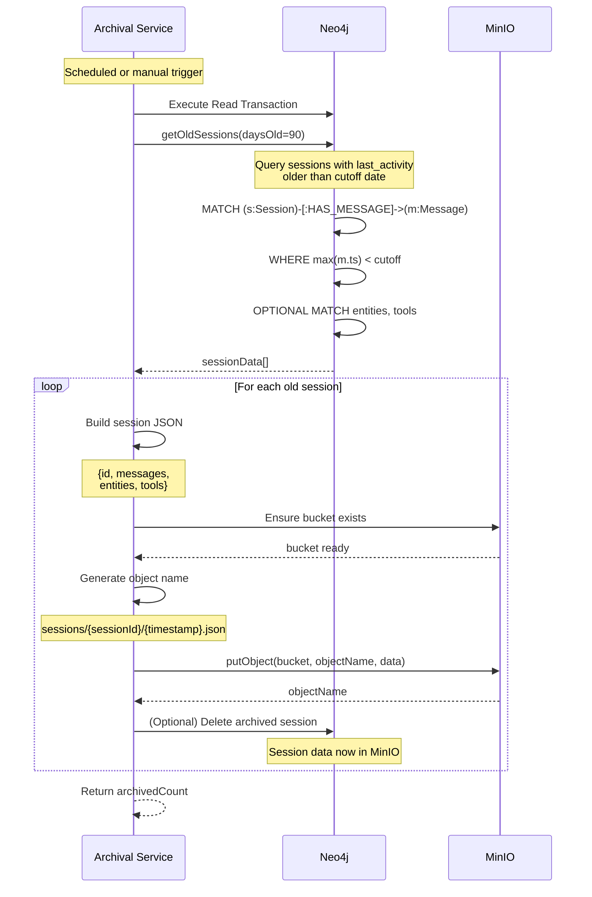

# Archival Sequence

This sequence diagram shows how old sessions are archived to MinIO for long-term storage.

**Note:** Archived data is now integrated into the memory retrieval system. When `recall_memories` is called, archived sessions are searched alongside active data. See [long-term-memory.md](long-term-memory.md) for details.

