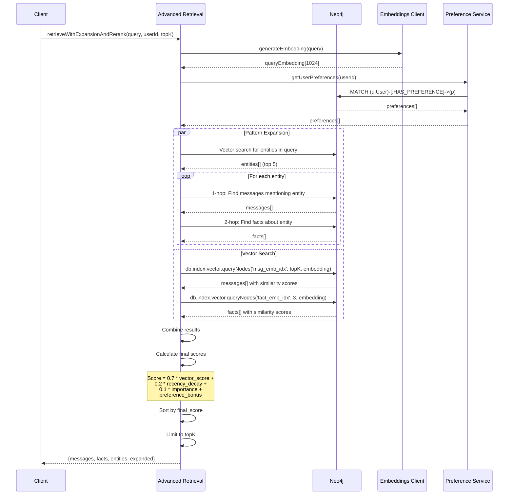

# Hybrid Retrieval with Expansion Sequence

This sequence diagram shows the advanced retrieval process with pattern expansion and reranking. **Note:** This diagram shows the core retrieval flow. When `includeArchived` is enabled (default), archived sessions from MinIO are also searched and merged with these results. See [sequences-recall-memories.md](sequences-recall-memories.md) for the complete flow including archived memory.

