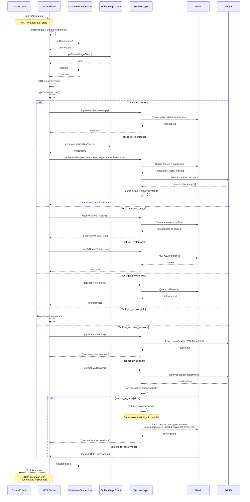

# MCP Server Tool Call Sequence

This sequence diagram shows the general flow of MCP tool calls through the server.

```mermaid
sequenceDiagram
    participant Cursor as Cursor/Client
    participant MCPServer as MCP Server
    participant DB as Database Connection
    participant EmbeddingsClient as Embeddings Client
    participant Service as Service Layer
    participant Neo4j
    participant MinIO

    Cursor->>MCPServer: Call Tool Request
    Note over Cursor,MCPServer: MCP Protocol over stdio
    
    MCPServer->>MCPServer: Parse request (name, arguments)
    
    MCPServer->>DB: getConnection()
    DB-->>MCPServer: connection
    
    MCPServer->>EmbeddingsClient: getEmbeddingsClient()
    EmbeddingsClient-->>MCPServer: client
    
    MCPServer->>DB: session()
    DB-->>MCPServer: session
    
    MCPServer->>MCPServer: getOrCreateSession()
    MCPServer->>MCPServer: getOrCreateUser()
    
    alt Tool: store_memory
        MCPServer->>Service: ingestEnrichedMessage()
        Service->>Neo4j: Store with entity/fact extraction
        Neo4j-->>Service: messageId
        Service-->>MCPServer: messageId
    else Tool: recall_memories
        MCPServer->>EmbeddingsClient: generateEmbedding(query)
        EmbeddingsClient-->>MCPServer: embedding
        MCPServer->>Service: retrieveWithExpansionAndRerank(includeArchived=true)
        Service->>Neo4j: Hybrid search + expansion
        Neo4j-->>Service: {messages, facts, entities}
        Service->>MinIO: Search archived sessions
        MinIO-->>Service: archivedMessages[]
        Service->>Service: Merge active + archived results
        Service-->>MCPServer: {messages, facts, entities}
    else Tool: track_tool_usage
        MCPServer->>Service: ingestWithToolTracking()
        Service->>Neo4j: Store message + tool call
        Neo4j-->>Service: (messageId, toolCallId)
        Service-->>MCPServer: (messageId, toolCallId)
    else Tool: set_preference
        MCPServer->>Service: createOrUpdatePreference()
        Service->>Neo4j: MERGE preference
        Neo4j-->>Service: success
        Service-->>MCPServer: success
    else Tool: get_preferences
        MCPServer->>Service: getUserPreferences()
        Service->>Neo4j: Query preferences
        Neo4j-->>Service: preferences[]
        Service-->>MCPServer: preferences[]
    else Tool: get_session_info
        MCPServer->>MCPServer: Return session/user IDs
    else Tool: list_archived_sessions
        MCPServer->>Service: getArchivalService()
        Service->>MinIO: listArchivedSessionsWithMetadata()
        MinIO-->>Service: sessions[]
        Service-->>MCPServer: {sessions, total, returned}
    else Tool: replay_session
        MCPServer->>Service: getArchivalService()
        Service->>MinIO: retrieveSession(objectName)
        MinIO-->>Service: sessionData
        Service->>Service: Sort messages chronologically
        alt restore_to_neo4j=true
            Service->>Service: restoreSessionToNeo4j()
            Note over Service: Generate embeddings in parallel
            Service->>Neo4j: Batch restore messages, entities<br/>(tools not restored - relationships not preserved)
            Neo4j-->>Service: restoreStats
            Service-->>MCPServer: {sessionData, restoreStats}
        else restore_to_neo4j=false
            Service-->>MCPServer: {sessionData, messages[]}
        end
    end
    
    MCPServer->>DB: session.close()
    MCPServer-->>Cursor: Tool Response
    Note over MCPServer,Cursor: JSON response with<br/>content and isError flag
```

