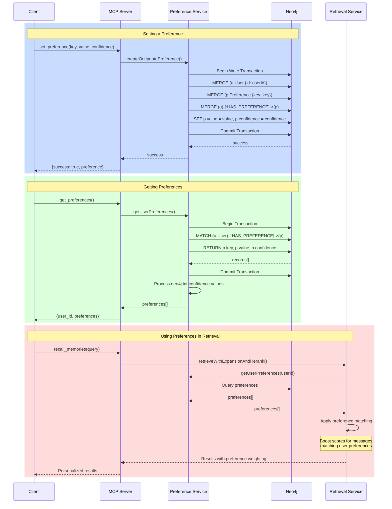

# Preference Management Sequence

This sequence diagram shows how user preferences are set and retrieved for personalized retrieval.

```mermaid
sequenceDiagram
    participant Client
    participant MCPServer as MCP Server
    participant PreferenceService as Preference Service
    participant Neo4j
    participant RetrievalService as Retrieval Service

    rect rgb(200, 220, 255)
        Note over Client,Neo4j: Setting a Preference
        Client->>MCPServer: set_preference(key, value, confidence)
        MCPServer->>PreferenceService: createOrUpdatePreference()
        
        PreferenceService->>Neo4j: Begin Write Transaction
        PreferenceService->>Neo4j: MERGE (u:User {id: userId})
        PreferenceService->>Neo4j: MERGE (p:Preference {key: key})
        PreferenceService->>Neo4j: MERGE (u)-[:HAS_PREFERENCE]->(p)
        PreferenceService->>Neo4j: SET p.value = value, p.confidence = confidence
        PreferenceService->>Neo4j: Commit Transaction
        Neo4j-->>PreferenceService: success
        PreferenceService-->>MCPServer: success
        MCPServer-->>Client: {success: true, preference}
    end
    
    rect rgb(220, 255, 220)
        Note over Client,Neo4j: Getting Preferences
        Client->>MCPServer: get_preferences()
        MCPServer->>PreferenceService: getUserPreferences()
        
        PreferenceService->>Neo4j: Begin Transaction
        PreferenceService->>Neo4j: MATCH (u:User)-[:HAS_PREFERENCE]->(p)
        PreferenceService->>Neo4j: RETURN p.key, p.value, p.confidence
        Neo4j-->>PreferenceService: records[]
        PreferenceService->>Neo4j: Commit Transaction
        
        PreferenceService->>PreferenceService: Process neo4j.int confidence values
        PreferenceService-->>MCPServer: preferences[]
        MCPServer-->>Client: {user_id, preferences}
    end
    
    rect rgb(255, 220, 220)
        Note over Client,RetrievalService: Using Preferences in Retrieval
        Client->>MCPServer: recall_memories(query)
        MCPServer->>RetrievalService: retrieveWithExpansionAndRerank()
        
        RetrievalService->>PreferenceService: getUserPreferences(userId)
        PreferenceService->>Neo4j: Query preferences
        Neo4j-->>PreferenceService: preferences[]
        PreferenceService-->>RetrievalService: preferences[]
        
        RetrievalService->>RetrievalService: Apply preference matching
        Note over RetrievalService: Boost scores for messages<br/>matching user preferences
        
        RetrievalService-->>MCPServer: Results with preference weighting
        MCPServer-->>Client: Personalized results
    end
```

