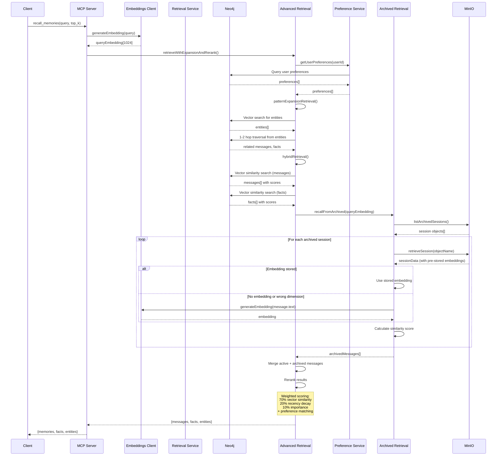

# Recall Memories Sequence

This sequence diagram shows how semantic search retrieves relevant memories from the graph database.

```mermaid
sequenceDiagram
    participant Client
    participant MCPServer as MCP Server
    participant EmbeddingsClient as Embeddings Client
    participant RetrievalService as Retrieval Service
    participant Neo4j
    participant AdvancedRetrieval as Advanced Retrieval
    participant PreferenceService as Preference Service
    participant ArchivedRetrieval as Archived Retrieval
    participant MinIO

    Client->>MCPServer: recall_memories(query, top_k)
    MCPServer->>EmbeddingsClient: generateEmbedding(query)
    EmbeddingsClient-->>MCPServer: queryEmbedding[1024]
    
    MCPServer->>AdvancedRetrieval: retrieveWithExpansionAndRerank()
    
    AdvancedRetrieval->>PreferenceService: getUserPreferences(userId)
    PreferenceService->>Neo4j: Query user preferences
    Neo4j-->>PreferenceService: preferences[]
    PreferenceService-->>AdvancedRetrieval: preferences[]
    
    AdvancedRetrieval->>AdvancedRetrieval: patternExpansionRetrieval()
    AdvancedRetrieval->>Neo4j: Vector search for entities
    Neo4j-->>AdvancedRetrieval: entities[]
    AdvancedRetrieval->>Neo4j: 1-2 hop traversal from entities
    Neo4j-->>AdvancedRetrieval: related messages, facts
    
    AdvancedRetrieval->>AdvancedRetrieval: hybridRetrieval()
    AdvancedRetrieval->>Neo4j: Vector similarity search (messages)
    Neo4j-->>AdvancedRetrieval: messages[] with scores
    AdvancedRetrieval->>Neo4j: Vector similarity search (facts)
    Neo4j-->>AdvancedRetrieval: facts[] with scores
    
    AdvancedRetrieval->>ArchivedRetrieval: recallFromArchived(queryEmbedding)
    ArchivedRetrieval->>MinIO: listArchivedSessions()
    MinIO-->>ArchivedRetrieval: session objects[]
    loop For each archived session
        ArchivedRetrieval->>MinIO: retrieveSession(objectName)
        MinIO-->>ArchivedRetrieval: sessionData (with pre-stored embeddings)
        alt Embedding stored
            ArchivedRetrieval->>ArchivedRetrieval: Use stored embedding
        else No embedding or wrong dimension
            ArchivedRetrieval->>EmbeddingsClient: generateEmbedding(message.text)
            EmbeddingsClient-->>ArchivedRetrieval: embedding
        end
        ArchivedRetrieval->>ArchivedRetrieval: Calculate similarity score
    end
    ArchivedRetrieval-->>AdvancedRetrieval: archivedMessages[]
    
    AdvancedRetrieval->>AdvancedRetrieval: Merge active + archived messages
    AdvancedRetrieval->>AdvancedRetrieval: Rerank results
    Note over AdvancedRetrieval: Weighted scoring:<br/>70% vector similarity<br/>20% recency decay<br/>10% importance<br/>+ preference matching
    
    AdvancedRetrieval-->>MCPServer: {messages, facts, entities}
    MCPServer-->>Client: {memories, facts, entities}
```

