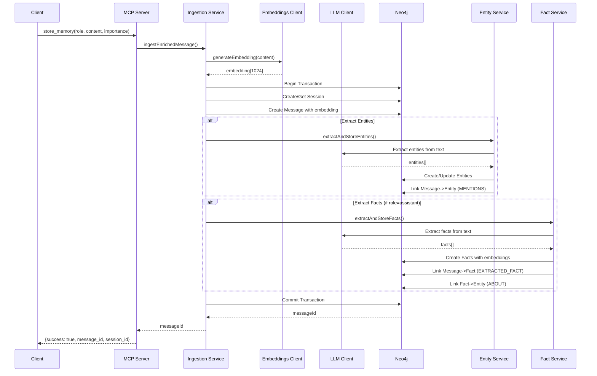

# Store Message Sequence

This sequence diagram shows how a message is stored with automatic entity and fact extraction.

```mermaid
sequenceDiagram
    participant Client
    participant MCPServer as MCP Server
    participant IngestService as Ingestion Service
    participant EmbeddingsClient as Embeddings Client
    participant LLMClient as LLM Client
    participant Neo4j
    participant EntityService as Entity Service
    participant FactService as Fact Service

    Client->>MCPServer: store_memory(role, content, importance)
    MCPServer->>IngestService: ingestEnrichedMessage()
    
    IngestService->>EmbeddingsClient: generateEmbedding(content)
    EmbeddingsClient-->>IngestService: embedding[1024]
    
    IngestService->>Neo4j: Begin Transaction
    IngestService->>Neo4j: Create/Get Session
    IngestService->>Neo4j: Create Message with embedding
    
    alt Extract Entities
        IngestService->>EntityService: extractAndStoreEntities()
        EntityService->>LLMClient: Extract entities from text
        LLMClient-->>EntityService: entities[]
        EntityService->>Neo4j: Create/Update Entities
        EntityService->>Neo4j: Link Message->Entity (MENTIONS)
    end
    
    alt Extract Facts (if role=assistant)
        IngestService->>FactService: extractAndStoreFacts()
        FactService->>LLMClient: Extract facts from text
        LLMClient-->>FactService: facts[]
        FactService->>Neo4j: Create Facts with embeddings
        FactService->>Neo4j: Link Message->Fact (EXTRACTED_FACT)
        FactService->>Neo4j: Link Fact->Entity (ABOUT)
    end
    
    IngestService->>Neo4j: Commit Transaction
    Neo4j-->>IngestService: messageId
    IngestService-->>MCPServer: messageId
    MCPServer-->>Client: {success: true, message_id, session_id}
```

