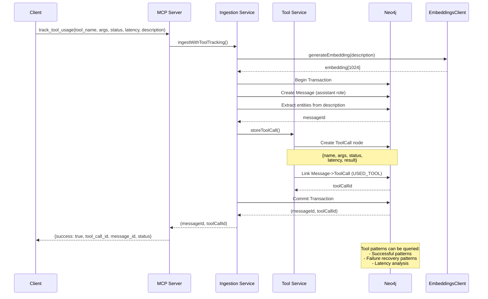

# Tool Tracking Sequence

This sequence diagram shows how tool calls are tracked for pattern learning and failure recovery.

```mermaid
sequenceDiagram
    participant Client
    participant MCPServer as MCP Server
    participant IngestService as Ingestion Service
    participant ToolService as Tool Service
    participant Neo4j

    Client->>MCPServer: track_tool_usage(tool_name, args, status, latency, description)
    
    MCPServer->>IngestService: ingestWithToolTracking()
    
    IngestService->>EmbeddingsClient: generateEmbedding(description)
    EmbeddingsClient-->>IngestService: embedding[1024]
    
    IngestService->>Neo4j: Begin Transaction
    IngestService->>Neo4j: Create Message (assistant role)
    IngestService->>Neo4j: Extract entities from description
    Neo4j-->>IngestService: messageId
    
    IngestService->>ToolService: storeToolCall()
    ToolService->>Neo4j: Create ToolCall node
    Note over ToolService,Neo4j: {name, args, status,<br/>latency, result}
    ToolService->>Neo4j: Link Message->ToolCall (USED_TOOL)
    Neo4j-->>ToolService: toolCallId
    
    IngestService->>Neo4j: Commit Transaction
    Neo4j-->>IngestService: (messageId, toolCallId)
    IngestService-->>MCPServer: (messageId, toolCallId)
    MCPServer-->>Client: {success: true, tool_call_id, message_id, status}
    
    Note over Neo4j: Tool patterns can be queried:<br/>- Successful patterns<br/>- Failure recovery patterns<br/>- Latency analysis
```

